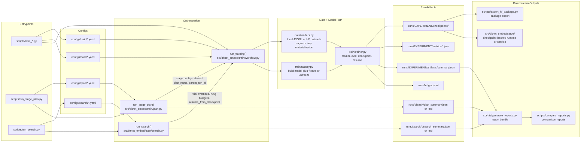

# bitnet-embed

BitNet-based embedding research stack built from `bitnet_embedding_sdd_full.md`.

## Scope

- BitNet BF16 backbone integration for embedding research
- Masked mean pooling + projection + normalization baseline
- Head-only smoke training loop with Accelerate
- FastAPI `/v1/embeddings` service with health and metrics endpoints
- Smoke evaluation harnesses for retrieval, STS, and latency

## Quickstart

```bash
uv sync --all-groups
uv run pytest
uv run python scripts/train_smoke.py --config configs/train/smoke.yaml
uv run python scripts/export_openapi.py --config configs/service/api.yaml
uv run python scripts/run_api.py --config configs/service/api.yaml
```

## Layout

- `docs/sdd.md`: in-repo pointer to the source SDD
- `configs/`: model, data, train, and eval YAML configs
- `data/smoke/`: local staged smoke datasets for pair, triplet, STS, and retrieval flows
- `src/bitnet_embed/`: package source
- `scripts/`: runnable entrypoints for smoke, training, evaluation, and benchmark flows
- `tests/`: unit and integration smoke tests

## Training Architecture



- Single-run training starts from `scripts/train_smoke.py`, `scripts/train_head_only.py`, `scripts/train_lora.py`, or `scripts/train_full.py`, each of which resolves train and data config inputs before calling `run_training()`.
- `run_training()` builds datasets from `src/bitnet_embed/data/loaders.py`, constructs the model, freezes the backbone for head-only mode or unfreezes it for LoRA/full runs, then hands batches to `EmbeddingTrainer`.
- Stage plans in `configs/plan/` call `run_training()` repeatedly with shared `plan_name` and `parent_run_id`, producing per-stage runs plus `plan_summary.json` and `plan_summary.md`.
- Fixed-budget search in `configs/search/` writes per-rung trial configs, caps each rung with `max_update_steps`, ranks trials by a primary metric, and resumes promoted trials from their saved checkpoints.
- Every run writes checkpoints, step metrics, and `artifacts/summary.json` under `runs/`, and also appends a durable `runs/ledger.jsonl` entry so completions, failures, and resume lineage are recorded in one place.
- Those training artifacts feed downstream report bundling, report comparison, HF-style package export, and the checkpoint-backed runtime under `src/bitnet_embed/serve/`.

## Stage Plans

- `configs/plan/smoke_stages.yaml`: local multi-stage progression matching the SDD's early-stage flow
- `scripts/run_stage_plan.py`: sequential stage runner with JSON and Markdown plan summaries

## Service Artifacts

- `configs/service/api.yaml`: service runtime defaults
- `docs/openapi.json`: generated OpenAPI schema
- `.github/workflows/ci.yml`: lint, typecheck, test, smoke-train, and OpenAPI export checks

## Packaging

- `scripts/export_hf_package.py`: export a checkpoint into an HF-style package directory with config, weights, tokenizer, and README

## Reports

- `scripts/generate_reports.py`: bundle stage, latency, ANN, and package artifacts into a single summary
- `scripts/compare_reports.py`: compare one or more bundled report outputs into a compact comparison artifact
- `scripts/benchmark_memory.py`: generate RSS/CUDA memory benchmarks for the current runtime configuration
- `scripts/eval_sts.py`: generate a standalone STS report artifact from scored-pair evaluation data
- `scripts/eval_clustering.py`: generate a standalone clustering report artifact from labeled smoke data

## Phase 2

- `scripts/phase2_feasibility.py`: emit a readiness report for the future `bitnet.cpp` low-bit runtime path

## Notes

- The first milestone keeps BitNet quality validation separate from any future `bitnet.cpp` efficiency track.
- The training/test defaults use tiny synthetic or local data paths so the repository can smoke-test without downloading large public datasets.
